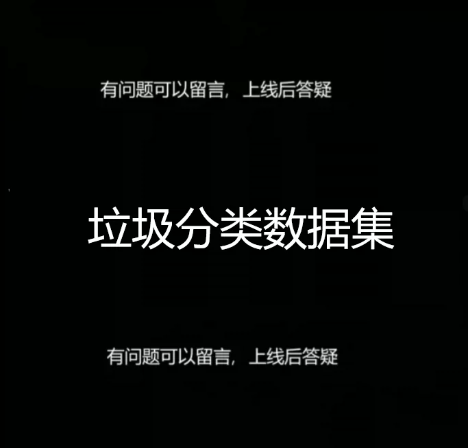
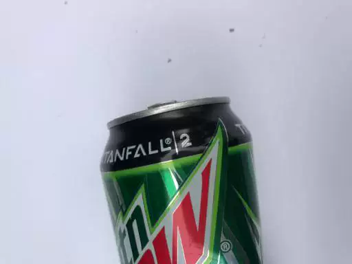
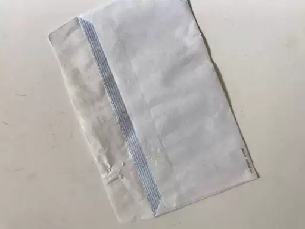

## Body

**Waste Sorting Data Set**

The waste sorting dataset consists of 6 categories: cardboard (393 items), glass (491 items), metal (400 items), paper (584 items), plastic (472 items), and trash (127 items).

## Images

item_1029371663131

Here is a pay link on Stripe ( https://buy.stripe.com/3cs8yP7sY87d0vu9AB ). Please contact me lonlonago@foxmail.com after funding $89, and I will send you a complete data files , thank you!

